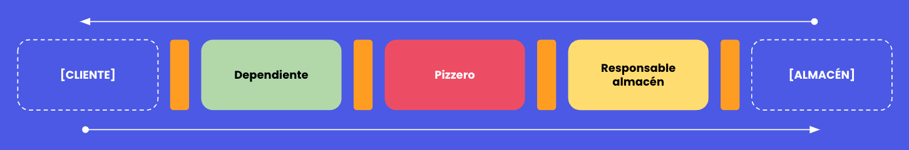

[](https://img.shields.io/badge/android-bootcamp-orange?style=flat-square)

# Android bootcamp - Restaurante de pizza
---
## ✍️ Acerca de

Este entrenamiento esta preparado para que practiques tu capacidad de trabajo en equipo y tu compresión
de las interfaces.

En este caso vamos a trabajar en un restaurante de pizza (**Francesco's pizza**) tenéis que dividiros en grupos de 3 y cada uno
de vosotr@s tendréis que desempeñar un rol distinto.

- Dependiente
- Cocinero
- Encargado del almacen



## Roles
Cada rol tiene una misión única y es absolutamente necesario para poder hacer funcionar el restaurante. 

### 🧑‍💼 Dependient@
Tu misión es recibir los pedidos del cliente para darselos al cocinero y gestionar cualquier problema que este pueda tener.
Además al finalizar deberás calcular el importe del pedido y cobrar al cliente.

Puedes interactuar con el cocinero a través de:

```kotlin
enum class FoodStatus {
    DONE,
    MISSINGINGREDIENTS
}

interface CookerInterface {
    fun cook(pizza: MenuPizza): FoodStatus
}
```

### 🧑‍🍳‍ Cociner@
Tu misión es cocinar todos los productos para ello necesitas ingredientes que tendrá que proporcionarte el encargado de almacen.
Para cocinar necesitas restar a los ingredientes de la pizza los ingredientes obtenidos del encargado del almacen. Recuerda avisar al dependiente si no puedes cocinar la pizza del cliente

Puedes interactuar con el encargado del almacen a través de:

```kotlin
interface WareHouseWorkerInterface {
    fun checkWithdrawAndReturn(ingredient: Ingredient): Ingredient?
}
```

### 👷 Encargad@ del almacen
Tu misión es obtener y manejar el stock del almacen. Los ingredientes no son infinitos recuerdalo. Tu almacen funciona así:

```kotlin
interface WareHouseInterface {
    fun getIngredient(name: String): Ingredient
    fun withdraw(ingredient: Ingredient)
}

class WareHouse(var stocks: List<Stock>): WareHouseInterface {
    override fun getIngredient(name: String): Ingredient {
        var stock = stocks.firstOrNull { it.ingredient.name == name }
        if (stock != null) {
            return stock.ingredient
        }
        throw(NotFoundException(message = "ERROR: [$name] no se ha encontrado"))
    }

    override fun withdraw(ingredient: Ingredient) {
        var stock: Stock = stocks.firstOrNull { it.ingredient.name == ingredient.name }.let { it }
            ?: throw(NotFoundException(message = "ERROR: [${ingredient.name}] no se ha encontrado"))
        if (stock.quantity - 1 < 0) {
            throw(NotEnoughException(message = "ERROR: No hay suficiente cantidad de [${ingredient.name}]"))
        }
        stock.quantity -= 1
    }
}
```

## 🎯 Objetivos
Para llevar a buen cabo este entrenamiento deberás de:
- Desarrollar tecnicamente tu rol
- Entender que las cosas no siempre van bien, es decir, no solo existe el "happy path"
- Trabaja en equipo encuentra la forma de que tu restaurante funcione

---


**Develop by rudo apps**

hola@rudo.es | https://www.rudo.es